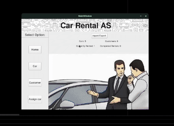

# 🚗 CarRental




## 📌 Overview
CarRental is a **Qt & C++** GUI application that uses **SQLite** as a database to manage a simple car rental system. This project demonstrates how to build a graphical user interface for handling car reservations, rentals, and customer data efficiently.

## 🛠️ Features
- **Graphical User Interface (GUI)** built using **Qt**.
- **SQLite** database integration for storing rental records.
- **Car management** (adding, updating, deleting cars).
- **Customer management** (storing customer details and rental history).
- **Booking system** to rent and return cars.

## 📂 Project Structure
```
CarRental/
│-- Data/
│-- Database/
│-- GUI/
│-- Libraries/
│-- Queries/
│-- build/
│-- cmake-build-debug/
│-- docs/
│   ├── ezgif-67159d5353093c.gif
│-- rental/
│-- .gitignore
│-- CMakeLists.txt
│-- README.md
│-- examplejson.json
│-- main.cpp
```

## 🚀 Getting Started
### **1. Prerequisites**
Ensure you have the following installed:
- **Qt** (for GUI development)
- **C++ Compiler** (GCC, Clang, or MSVC)
- **CMake** (for project building)
- **SQLite** (for database management)

### **2. Build & Run**
```sh
mkdir build && cd build
cmake ..
make
./CarRental
```

## 📖 Usage
1. **Launch the application**.
2. **Add new cars and customers** to the database.
3. **Manage rentals** through the GUI.
4. **Track rental history and availability** of cars.

## 🤝 Contributing
Feel free to contribute by submitting **pull requests** or reporting issues.

## 📜 License
This project is licensed under the **MIT License**.

---
### 🎥 **Demo**
For a quick overview, check the animation above! 📺

